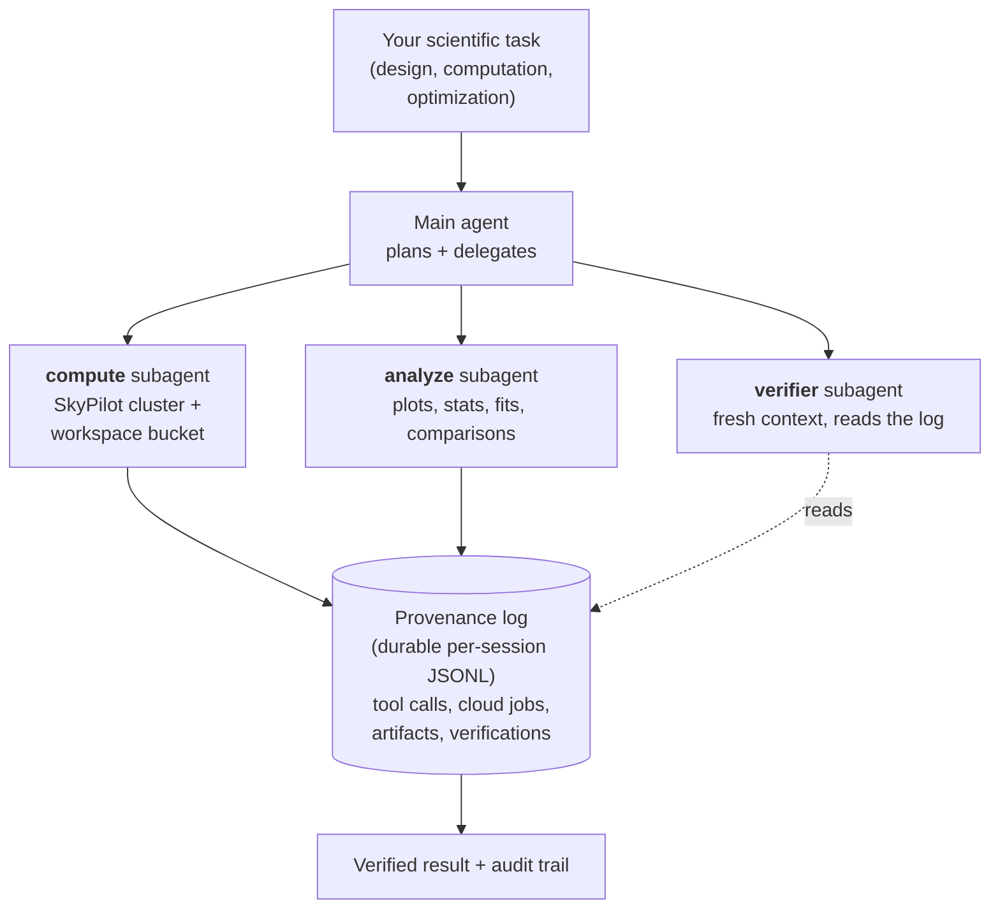

# SciAgent

SciAgent is a modular agent framework for software engineering and scientific computing. It combines a standard agent loop with dependency-aware task orchestration, allowing the language model to plan and execute complex workflows by invoking external tools, containerised services, and cloud compute.

> **v2.0 is current.** Highlights: cloud compute via SkyPilot, durable provenance log, task orchestration with background subagents and checkpoint/resume. See [What's New in v2.0](docs/whats-new-v2.md). v1.0 is preserved on branch `release/v1.0` and tag `v1.0`.

## How it works

You give sciagent a scientific task — a simulation to run, a hypothesis to test, a dataset to analyze, results to reproduce or extend. It plans, delegates to specialised sub-agents, runs the heavy work on a cloud cluster, derives the result, and an independent verifier checks the trail before you see the answer. Every tool call, cloud job, artifact, and verification is appended to a durable per-session log — the audit comes out of normal operation.



Properties of this loop:

- **Cloud compute.** `compute` runs simulations on SkyPilot-managed clusters with a per-session S3/GCS/Azure/R2/OCI workspace bucket. Outputs survive cluster teardown.
- **Durable log.** Every tool call, cloud job, artifact, and verification appends to a per-session JSONL log. The audit trail comes out of normal operation.
- **Verifier with fresh context.** The `verifier` sub-agent has no memory of the main agent's reasoning. It reads only the log and the on-disk artifacts. A different model in a different process can audit a session it didn't run.
- **Scientific services in registered containers.** Twenty-plus images (RCWA, MEEP, OpenFOAM + SWAK4Foam, GROMACS, ParaView, OpenROAD, ...). The user does not manage container builds or host environments.
- **Background sub-agents with checkpoints.** Per-iteration checkpoints; if a long-running run is interrupted, the next spawn matches by description hash and offers the parent a 3-way resume (skip · use prior · retry).

## Features

- **Cloud compute** – Run scientific simulations on cloud clusters via SkyPilot, with a local Docker fallback for small jobs. Per-session workspace bucket persists outputs across cluster lifecycle. See [Cloud Compute](docs/cloud-compute.md).

- **Durable provenance log** – Every tool call, compute job, artifact, and verification result lands in an append-only JSONL log per session — cross-LLM verifiable. See [Provenance Log Schema](docs/provenance_log_schema.md).

- **Task orchestration** – Unified registry for in-flight work (`task_index`) covering cloud jobs and background subagents. Background subagents support checkpoint and 3-way resume. See [Task Orchestration](docs/task-orchestration.md).

- **Skill-based workflows** – Load specialised workflows from SKILL.md files for complex tasks like service building and code review. Skills auto-trigger based on user input patterns.

- **Image & multimodal analysis** – Analyze scientific plots, microscopy images, diagrams, and data visualisations. Supports PNG, JPG, GIF, and WebP formats.

- **Service isolation** – Run all scientific computations inside isolated Docker containers for reproducibility, security, and portability.

- **Task DAG orchestration** – Define a graph of tasks with dependencies (`depends_on`), batch parallelisable steps and pass data between tasks via `result_key`.

- **Artifact & target validation** – Verify that expected files exist or that computed metrics meet user-defined criteria; `produces_uris` validation on subagent outputs.

- **Scientific services** – Run simulations inside Docker containers for electromagnetics (RCWA, MEEP), fluid dynamics (OpenFOAM + swak4foam), molecular dynamics (GROMACS), cheminformatics (RDKit), symbolic math (SymPy), optimisation (CVXPY), post-processing (ParaView), digital IC (OpenROAD, iic-osic-tools) and more.

- **Multi-model support** – Choose between Anthropic Claude, OpenAI (GPT-4.1, o3, o4-mini), Google Gemini 3, xAI Grok 4, DeepSeek, or open-source models via LiteLLM. Caching reduces cost and latency.

- **Sub-agents** – Spawn specialised agents for exploration, debugging, research, planning, cloud compute, post-job analysis, general implementation, and verification. Each agent uses a cost-optimised model tier (scientific for planning, coding for implementation, fast for exploration).

## Quick start

### Installation

SciAgent requires Python 3.9 or newer. We recommend installing it inside a virtual environment:

```bash
python3 -m venv venv
source venv/bin/activate
pip install -e .                # base install (local Docker compute)
pip install -e '.[cloud]'       # optional: SkyPilot + AWS extras
pip install -e '.[cloud-all]'   # optional: SkyPilot + AWS, GCP, Azure
```

PyPI package coming soon — for now, install from source.

### Set API keys

SciAgent communicates with large-language models and search engines via external APIs. At a minimum you need to export an API key for your chosen LLM provider and for the Brave search tool used by the `web` tool:

```bash
export ANTHROPIC_API_KEY="your-claude-key"      # or OPENAI_API_KEY, GOOGLE_API_KEY, etc.
export BRAVE_SEARCH_API_KEY="your-brave-key"   # required for web search
```

Additional environment variables (e.g. `OPENAI_API_KEY`, `GOOGLE_API_KEY`) can be set as needed depending on the model.

### Run a task

Invoke SciAgent via the `sciagent` CLI and pass a natural-language task description. A project directory is created to store generated code and artifacts:

```bash
sciagent --project-dir ~/my-project "Create a Python script that calculates Fibonacci numbers"
```

Use the `--interactive` flag to enter a REPL for iterative control:

```bash
sciagent --interactive
```

Select a different model or enable sub-agents when needed:

```bash
sciagent -m openai/gpt-4.1 "Analyze this codebase"
sciagent -m gemini/gemini-3-pro-preview "Explain this diagram"
sciagent --subagents "Research and refactor this module"
```

For more details on CLI flags see the [Configuration](docs/configuration.md) guide or run `sciagent --help`.

## Image analysis examples

SciAgent can analyze images including scientific plots, microscopy, diagrams, and data visualisations:

```bash
# Analyze a scientific plot
sciagent "Read and interpret the graph at ./results/figure1.png"

# Examine microscopy images
sciagent "Analyze the cell structure in ./data/microscopy.jpg"

# Interpret simulation output
sciagent "What does the CFD velocity field in ./output/velocity.png show?"

# Review data visualisation
sciagent "Explain the trends in ./plots/timeseries.png and suggest improvements"
```

Supported formats: PNG, JPG/JPEG, GIF, WebP.

## Scientific computing examples

SciAgent can run simulations directly in specialised Docker containers. Some examples:

```bash
# RCWA electromagnetic simulation
sciagent "Design a photonic crystal with bandgap at 1550 nm using rcwa"

# Molecular dynamics (GROMACS)
sciagent "Run a GROMACS simulation for a protein in water"

# Convex optimisation (CVXPY)
sciagent "Solve a portfolio optimisation problem using cvxpy"

# Symbolic math (SymPy)
sciagent "Derive equations of motion for a double pendulum using sympy"

# Cloud-scale CFD (SkyPilot + OpenFOAM)
sciagent "Reproduce Fig 3 of the datacenter CFD paper on a SkyPilot cluster"
```

For an end-to-end cloud example, see the [Datacenter CFD case study](docs/case-studies/datacenter-cfd.md).

See [Available Services](#available-services) below for the full list of containerised environments.

## Available services

| Domain | Services | Capabilities |
|--------|----------|--------------|
| **Math & Optimisation** | `scipy-base`, `sympy`, `cvxpy`, `optuna` | Numerical computing, symbolic math, convex optimisation, hyperparameter tuning |
| **Chemistry & Materials** | `rdkit`, `ase`, `dwsim` | Molecular analysis, atomistic simulations, chemical process simulation |
| **Molecular Dynamics** | `gromacs` | Biomolecular simulations, soft matter |
| **Photonics & Optics** | `rcwa`, `meep`, `pyoptools` | RCWA for gratings, FDTD electromagnetics, optical ray tracing |
| **CFD & FEM** | `openfoam`, `gmsh`, `elmer` | Fluid dynamics, mesh generation, multiphysics FEM |
| **Post-processing & Visualisation** | `paraview` | Multi-arch (with EGL) — pairs with the OpenFOAM services |
| **Circuits & EDA** | `ngspice`, `openroad`, `iic-osic-tools` | SPICE simulation, RTL-to-GDS flow, 80+ IC design tools |
| **Quantum Computing** | `qiskit` | Quantum circuits, gates, algorithms (Grover, VQE, QAOA) |
| **Bioinformatics** | `biopython`, `blast` | Sequence analysis, BLAST searching, phylogenetics |
| **Network Analysis** | `networkx` | Graph algorithms, centrality, community detection |
| **Scientific ML** | `sciml-julia` | Julia ODE/SDE solving, symbolic modelling, neural DEs |

Services are automatically selected and managed when you request scientific computations. Refer to the [Architecture](docs/developers/architecture.md#service-registry) page for details.


## Skills

SciAgent uses a skill-based workflow system for complex, multi-phase tasks. Skills are defined in SKILL.md files and auto-trigger based on user input:

| Skill | Purpose |
|-------|---------|
| `use-service` | Look up a registered scientific service and run a simulation |
| `build-service` | Build and publish Docker services to GHCR |
| `code-review` | Comprehensive code review with security analysis |

The `use-service` skill implements a research-first workflow: discover the right service, read its docs, write the simulation code, run it in the container, debug. This ensures correct API usage by researching official documentation before writing simulation code.

## Sub-agents

SciAgent uses a tiered model system for cost-effective sub-agent delegation:

| Agent | Model Tier | Purpose |
|-------|------------|---------|
| `explore` | Fast | Quick codebase searches and file lookups |
| `debug` | Coding | Error investigation with web research |
| `research` | Coding | Web research, documentation, literature review |
| `plan` | Scientific | Break down complex problems (needs deep reasoning) |
| `compute` | Coding | Cloud-job orchestration with token-isolated context |
| `analyze` | Coding | Post-job derivation (plots, statistics, light fits, DSE) |
| `general` | Coding | Complex multi-step implementation tasks |
| `verifier` | Verification | Independent validation against the provenance log |

Model tiers are defined in `src/sciagent/defaults.py`. Current Anthropic defaults:

- **Scientific** — `claude-sonnet-4-6` (main agent, planning)
- **Coding** — `claude-sonnet-4-6` (debug, research, compute, analyze, verifier, general subagents)
- **Vision** — `claude-opus-4-7` (image and multimodal analysis)
- **Verification** — `claude-sonnet-4-6` (independent verifier subagent, fresh context)
- **Fast** — `claude-haiku-4-5-20251001` (explore subagent, web extraction, summarisation)

All tiers are provider-agnostic via [LiteLLM](https://github.com/BerriAI/litellm) — substitute any tier with `openai/...`, `gemini/...`, `xai/...`, `deepseek/...`, etc. See [Configuration](docs/configuration.md#alternative-models-by-provider) for tested vs. untested options.

## Architecture

SciAgent consists of a **Task Orchestrator** that schedules tasks in a directed acyclic graph and a set of **Agents** that execute those tasks. Each agent follows a Think → Act → Observe loop and can call core tools (`bash`, `file_ops`, `search`, `web`, `todo`, `skill`, `ask_user`), compute tools (`compute_run`, `compute_exec`, `compute_cluster`, `materialize`, `materialize_workspace`), task-orchestration tools (`task_list`, `task_get`, `task_wait`, `bg_*`), and verification tools (`verify_session`) to interact with the file system, shell, web, containerised simulations, cloud clusters, and the durable provenance log.

```
┌─────────────────────────────────────────────────┐
│                Task Orchestrator                │
│  ┌─────┐   ┌─────┐   ┌─────┐                   │
│  │ T1  │──▶│ T3  │──▶│ T4  │  (Task DAG)       │
│  └─────┘   └──┬──┘   └─────┘                   │
│  ┌─────┐     │       • depends_on              │
│  │ T2  │─────┘       • result_key              │
│  └─────┘             • parallel batching       │
└─────────────────────┬───────────────────────────┘
                      │
        ┌─────────────┼─────────────┐
        ▼             ▼             ▼
   ┌─────────┐   ┌─────────┐   ┌─────────┐
   │ Agent   │   │ Agent   │   │ Agent   │
   │ (T1)    │   │ (T2)    │   │ (T3)    │
   └────┬────┘   └────┬────┘   └────┬────┘
        │             │             │
        └─────────────┼─────────────┘
                      ▼
┌─────────────────────────────────────────────────┐
│  Tools: bash, file_ops, search, web, todo,      │
│         skill, ask_user                         │
│  Services: rcwa, meep, openfoam, gromacs, ...   │
└─────────────────────────────────────────────────┘
```

The v2.0 cloud + audit layer sits underneath:

```
┌──────────────────────────────────────────────────────┐
│ Compute subagent                                     │
│  compute_run / compute_exec / compute_cluster        │
│  materialize / materialize_workspace                 │
└──────────────┬───────────────────────────────────────┘
               │
       ┌───────┴────────┐
       ▼                ▼
  ┌──────────┐    ┌──────────────┐
  │  Local   │    │  SkyPilot    │     ┌──────────────────────┐
  │  Docker  │    │  managed     │◀────│ Workspace bucket     │
  │          │    │  / cluster   │     │ <cloud>://...-<sid>/ │
  └──────────┘    └──────┬───────┘     └──────────────────────┘
                         │
                         ▼
              ┌─────────────────────────┐
              │ Task index              │
              │ ~/.sciagent/tasks/*.json│
              │ kind=compute_job|sub…   │
              └─────────────────────────┘
                         │
                         ▼
              ┌─────────────────────────┐
              │ Provenance log (JSONL)  │
              │ tool_call/result        │
              │ compute_job_*           │
              │ artifact_produced       │
              │ verification_result     │
              └─────────────────────────┘
```

## Documentation

Comprehensive documentation is available in the `docs` folder. Start with the following pages:

- **[What's New in v2.0](docs/whats-new-v2.md)** – migration notes from v1.0, headline features, link to v1.0 archive.
- **[Getting Started](docs/getting-started.md)** – installation, running your first task and CLI basics.
- **[Configuration](docs/configuration.md)** – customise the model, system prompt, caching, tool registry, sub-agents, and cloud setup.
- **[Cloud Compute](docs/cloud-compute.md)** – SkyPilot integration, cluster lifecycle, workspace bucket, materialize.
- **[Task Orchestration](docs/task-orchestration.md)** – task index, background subagents, checkpoint and resume.
- **[Use Cases](docs/use-cases.md)** – real-world examples of how to apply SciAgent to coding, research and simulation.
- **[Architecture](docs/developers/architecture.md)** – detailed explanation of the agent loop, context management, tools, skills, sub-agents, SkyPilot integration, and the provenance log.
- **[Comparison](docs/comparison.md)** – what sets SciAgent apart from other agent frameworks.

## Requirements

- Python 3.9+
- Docker (for containerised services running locally)
- SkyPilot extras (`pip install '.[cloud]'`) — only required for cloud compute
- Cloud credentials (`aws configure` / `gcloud auth application-default login` / `az login`) — only required for cloud compute
- API key for your chosen LLM provider (e.g. Anthropic, OpenAI, Google) and `BRAVE_SEARCH_API_KEY` for web search

## License

This project is released under the Apache 2.0 License.

---

© 2026 SciAgent Team – building an open platform for AI-powered scientific computing and engineering.
