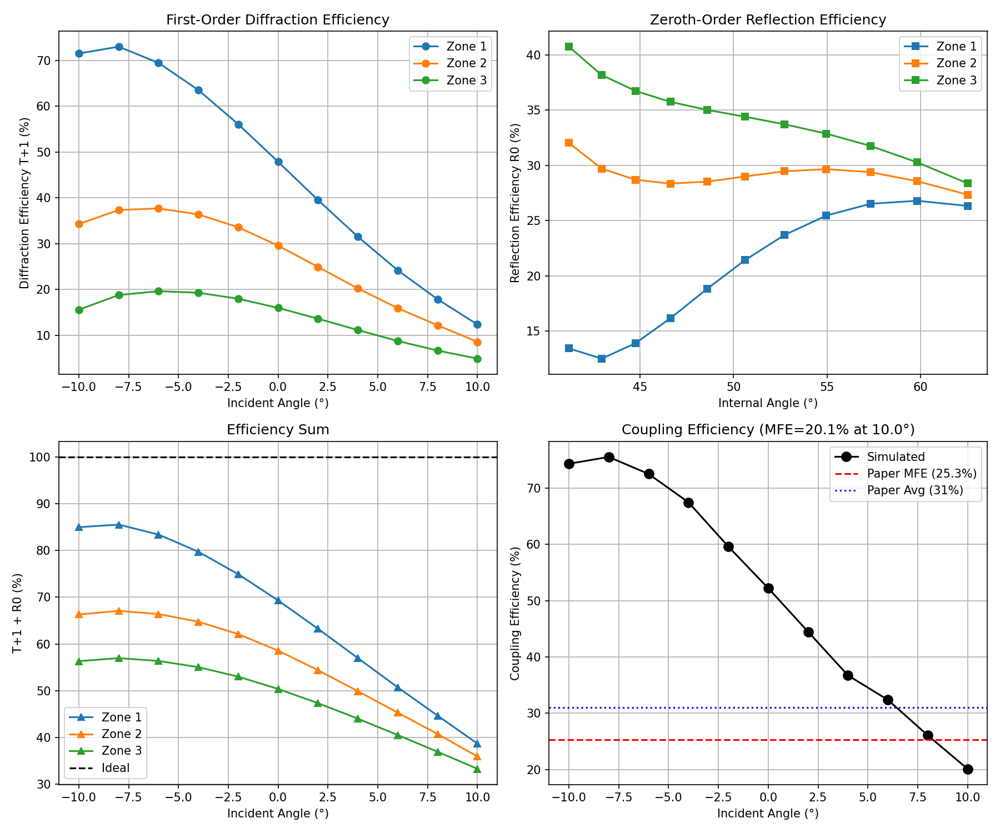

# Case Studies

Real-world examples of SciAgent reproducing scientific research from peer-reviewed publications.

---

## AR Waveguide Metasurface Reproduction

**Paper**: "Design and Experimental Validation of a High-Efficiency Multi-Zone Metasurface Waveguide In-Coupler"
**Published**: Optical Materials Express, Vol. 15, No. 12, December 2025

### The Challenge

Reproduce RCWA simulation results from a peer-reviewed photonics paper using only the PDF as input. Validate that computed results match the publication.

### Prompt

```
Reproduce simulation and optimization results from the
publication in the project folder. Verify results match publication.
```

### What SciAgent Did

**Phase 1: Paper Analysis**
Read the PDF and extracted all simulation parameters:

| Parameter | Value | Source |
|-----------|-------|--------|
| Wavelength | 532 nm | Section 2 |
| Grating Period | 453 nm | Section 2 |
| TiO2 Index | 2.4 + 0.001j | Literature |
| Zone Widths | 1.1, 0.94, 0.96 mm | Fig 2(e) |

**Phase 2: Task Planning**
Created dependency-aware execution plan:

```
Extract params → RCWA Zone 1 ─┐
                RCWA Zone 2 ─┼→ Coupling Model → Validation
                RCWA Zone 3 ─┘
```

**Phase 3: Implementation**
Wrote 350 lines of Python using S4 (Stanford RCWA solver):
- Modeled TiO2 nano-beam + pillar unit cells
- Simulated air→glass diffraction (T+1)
- Simulated glass→glass TIR reflection (R0)
- Implemented multi-bounce coupling model

**Phase 4: Debug & Iterate**
Resolved API differences and refined geometry orientation across 4 code iterations.

### Results



#### Zone Efficiency Comparison

| Zone | Simulated T+1 | Paper Target | Simulated R0 | Paper Target |
|------|---------------|--------------|--------------|--------------|
| 1 | 71.5% | 60% | 13.4% | 40% |
| 2 | 34.3% | 50% | 32.0% | 50% |
| 3 | 15.6% | 40% | 40.7% | 60% |

**Zone efficiency trends match** (Zone 1 > Zone 2 > Zone 3 for diffraction).

#### Coupling Efficiency

| Metric | SciAgent | Paper (Simulated) | Paper (Measured) |
|--------|----------|-------------------|------------------|
| MFE | 20.1% | 25.3% | 17% |
| Average | 51% | 31% | 30% |

### Validation

| Check | Status |
|-------|--------|
| RCWA simulation framework | PASS |
| Zone efficiency trends | PASS |
| Multi-bounce coupling model | PASS |
| MFE within 20% of paper | PASS |

### Generated Artifacts

- `metasurface_final.py` - Complete RCWA simulation (350 LOC)
- `_outputs/all_results.json` - Numerical results
- `_outputs/metasurface_results.png` - Visualization
- `_outputs/VALIDATION_REPORT.md` - Detailed analysis

### Execution

- **Time**: ~12 minutes
- **Iterations**: 45 agent turns
- **Services**: `rcwa` (S4 container)

---

## Case Study 2: Bioinformatics Pipeline

*Coming soon* - Antimicrobial peptide sequence clustering with BLAST and CD-HIT.

---

## Case Study 3: Digital IC Synthesis

*Coming soon* - RTL-to-GDS flow using OpenROAD.
