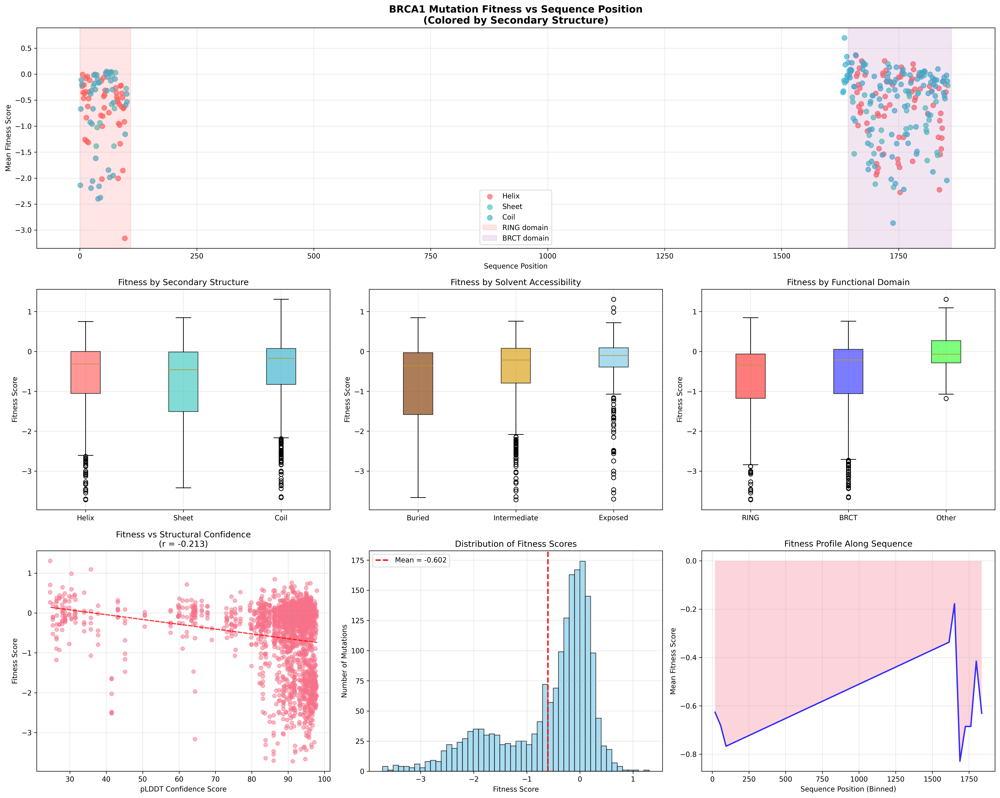

# BRCA1 Mutation Fitness-Structure Analysis

**Study**: "Accurate classification of BRCA1 variants with saturation genome editing"
**Published**: Findlay et al., Nature 562, 217-222 (2018)

This page is aligned to the tracked benchmark runs from **June 30, 2026**.

## The challenge

Map BRCA1 deep mutational scanning scores onto structural features from the AlphaFold model, then verify that the mapping rate clears the target threshold and that the expected structure-function signals appear.

## Prompt

```text
Analyze how BRCA1 mutation fitness scores correlate with protein structure
using the pre-downloaded data in `_data/`.

Data provided:
- `_data/BRCA1_HUMAN_Findlay_2018.csv` - Deep mutational scanning fitness scores
- `_data/AF-P38398-F1-model_v6.pdb` - AlphaFold predicted structure

Analysis steps:
1. Parse the fitness data and extract mutation positions
2. Load the AlphaFold PDB structure and extract per-residue features:
   - Secondary structure (helix, sheet, coil)
   - Relative solvent accessibility (buried vs exposed)
3. Map fitness scores to structural positions
4. Compute mean fitness by secondary structure, solvent accessibility,
   and functional domains (RING: 1-109, BRCT: 1642-1863)
5. Create visualizations and statistical analysis

Verification targets:
- 1,837 mutations parsed
- >95% mapping success to structure positions
- Statistical comparison of buried vs exposed residue fitness
```

## Trajectory snapshot

The benchmark pair for this task is:

- `icml_results_clean/20260630T135609Z/brca1_fitness_structure/brca1_fitness_structure__sciagent-verifier-on-default__sonnet/`
- `icml_results_clean/20260630T135609Z/brca1_fitness_structure/brca1_fitness_structure__cc-bare__sonnet/`

On **June 30, 2026**, both runs achieved a mapping rate of **1.00**. The SciAgent run additionally produced a verifier verdict of `verified` at confidence `0.78`.

## What SciAgent did

### Phase 1: Data parsing and alignment

SciAgent parsed all 1,837 mutations and aligned them to the BRCA1 AlphaFold structure.

### Phase 2: Structural feature extraction

The tracked run computed:

- secondary structure classes
- an accessibility proxy based on local structure
- domain-level summaries for RING and BRCT

### Phase 3: Single-script analysis

The actual June 30, 2026 run converged to a single main analysis script:

- `project/brca1_analysis.py`

That is a better reflection of the tracked artifact set than earlier multi-script summaries.

## Results



### Verification targets

| Check | Result |
|-------|--------|
| Mutations parsed | **1,837** |
| Mapping rate | **1.00** |
| Buried vs exposed test | **p = 1.48 × 10⁻⁴** |

### Mean fitness by secondary structure

| Structure | Mean fitness |
|-----------|--------------|
| Coil | -0.567 |
| Helix | -0.624 |
| Sheet | -0.668 |

### Mean fitness by accessibility

| Accessibility | Mean fitness |
|---------------|--------------|
| Buried | **-1.497** |
| Exposed | **-0.591** |

Buried residues are much less tolerant to mutation in this tracked run.

### Mean fitness by domain

| Domain | Mean fitness |
|--------|--------------|
| RING | -0.705 |
| BRCT | -0.582 |
| Other | -0.030 |

## Generated artifacts

The June 30, 2026 SciAgent run produced:

- `project/brca1_analysis.py`
- `project/_outputs/fitness_structure_mapped.csv`
- `project/_outputs/fitness_vs_position.png`
- `project/_outputs/summary.json`

## Audit note

The verifier accepted the run overall, but the benchmark report also notes a caught scope mismatch in the broader execution trail. That is exactly the kind of nuance the durable provenance log is meant to preserve even when the headline result is correct.

To inspect the raw artifacts, start with:

- `result.txt`
- `stdout.txt`
- `provenance.jsonl`
- `project/_outputs/summary.json`
