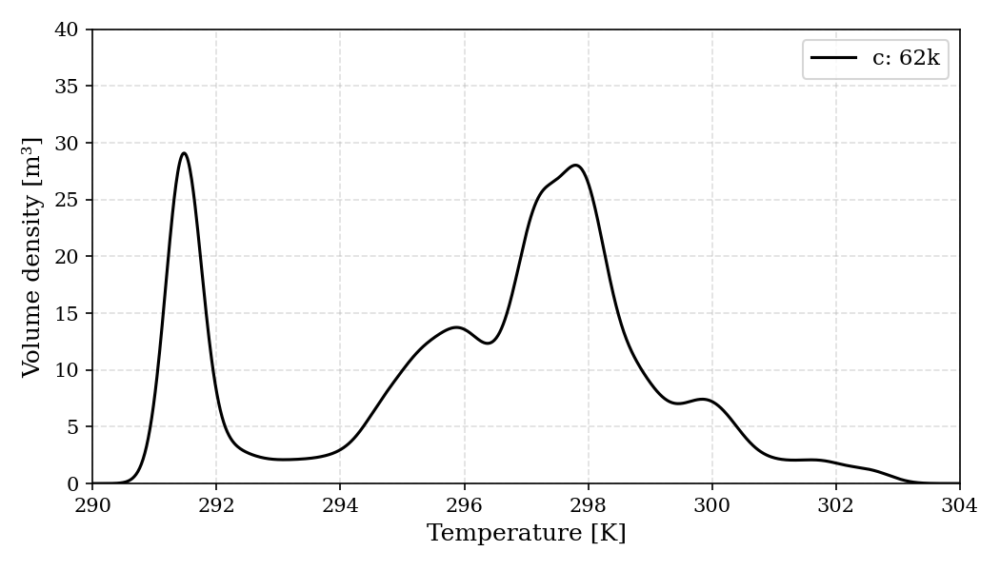

# Simulating Datacenter Temperature Distribution with OpenFOAM

**Paper**: Barestrand et al., "Modelling Convective Heat Transfer of Air in a Data Center using OpenFOAM — Evaluation of the Boussinesq Buoyancy Approximation"
**Published**: OpenFOAM Journal, Vol. 3 (2021), [doi:10.51560/ofj.v3.59](https://doi.org/10.51560/ofj.v3.59)

---

## The Challenge

Reproduce Fig 3 of the paper, the volume-weighted KDE of room temperature in a datacenter, starting from the manuscript PDF and the author's OpenFOAM case bundle. Run the heavy CFD on a cloud cluster (not the laptop), then analyze the saved fields locally. Cap the SIMPLE solver at 1000 iterations so cloud wall-clock stays under ~60 minutes on a small instance; the KDE shape is the target, not residual convergence.

## Prompt

```
Reproduce Fig 3 (typical Boussinesq, 62K grid) from the manuscript on
datacenter temperature distribution. Cap the solver at 1000 iterations
so wall clock stays under ~60 min on a small instance. The KDE shape
is what matters, not residual convergence.

Identify the OpenFOAM environment and boundary conditions from
Manuscript.pdf and the case files in the project folder.

Pull all intermediate and final results back into the project folder.
```

## What SciAgent Did

**Phase 1: Paper Analysis**
Read the manuscript and the author-provided case bundle to extract the simulation recipe with no human walkthrough of the physics:

| Choice | Value | Source |
|--------|-------|--------|
| Solver | buoyantBoussinesqSimpleFoam | Manuscript + case files |
| Turbulence | k-epsilon | constant/turbulenceProperties |
| Rack BCs | outletMappedUniformInletHeatAddition | 0.org/T |
| Supply T | 291.45 K (18.3 C) | Manuscript Sec. 2 |
| Grid | "c" coarse, 140 mm, Nx=47 x Ny=24 x Nz=50 | Manuscript Table |
| KDE bandwidth | covariance_factor = 0.1 | kdePlot.py |

**Phase 2: Stage Modified Case**
Wrote the coarse blockMeshDict (~56k background cells, ~62k after snappyHexMesh) and a 1000-iteration controlDict. Everything else preserved verbatim from the paper's steady_incompressible case.

**Phase 3: Cloud Compute**
Stood up a fresh AWS m6i.2xlarge (8 vCPU, 32 GB) cluster on demand and ran the meshing and solver pipeline there with 8-rank MPI:

```
blockMesh -> surfaceFeatureExtract -> snappyHexMesh -> checkMesh
        -> decomposePar -> buoyantBoussinesqSimpleFoam (parallel)
        -> reconstructPar -> writeCellVolumes -> T, V, logs
```

1000 SIMPLE iterations completed in 258 s wall-clock. Result fields and logs materialized to the local project folder via S3-backed workspace; cluster torn down afterwards.

**Phase 4: Local KDE Analysis**
Parsed the saved temperature and cell-volume fields (61,927 cells), computed the volume-weighted Gaussian KDE with the paper's bandwidth (covariance_factor = 0.1), and rendered the plot. Sim and analysis as separate stages means the same fields can be re-analyzed (different bandwidth, different slice) without re-running the solver.

## Results



### KDE Comparison vs. Paper Fig 3 ("c: 62k" curve)

| Metric | This run | Paper (c: 62k) |
|--------|----------|----------------|
| Cell count | 61,927 | ~62,000 |
| T range | 290.92 to 302.93 K | ~291 to 303 K |
| Supply T | 291.45 K | 291.45 K |
| T_mean (vol-weighted) | 296.21 K (23.06 C) | ~295 to 296 K |
| Total domain volume | 117.59 m^3 | 117.6 m^3 |
| KDE integral | 117.59 m^3 (self-consistent) | - |

The KDE shows the multimodal structure expected from a hot-aisle/cold-aisle layout: a sharp cold-supply peak near 291.5 K, an intermediate mixing region, and a warm exhaust peak near 298 K. The qualitative agreement with the paper's "c: 62k" curve is what the figure tests; residual convergence is intentionally not the gate at this iteration cap.

### Mesh Quality (checkMesh)

| Metric | Value |
|--------|-------|
| Cells | 61,927 |
| Total volume | 117.59 m^3 |
| Max non-orthogonality | 48.1 deg |
| Mean non-orthogonality | 4.0 deg |
| Max skewness | 2.75 |
| Mesh OK | yes |

## Validation

| Check | Status |
|-------|--------|
| Solver matches paper | PASS |
| Coarse grid ~62k cells | PASS (61,927) |
| 1000-iter cap honored | PASS |
| Boundary conditions match manuscript | PASS |
| KDE shape vs Fig 3 | PASS |
| KDE integral = total volume | PASS |
| Cluster torn down on completion | PASS |

## Generated Artifacts

- `_outputs/fig3_kde.png` - Fig 3 reproduction (150 dpi raster)
- `_outputs/fig3_kde.pdf` - Fig 3 reproduction (vector)
- `_outputs/fig3_metadata.json` - full provenance (n_cells, T range, peak, T_mean, KDE settings, solver, OF version, DOI)
- `_outputs/workspace/fig3_run/T_V.csv` - 61,927-row table (T [K], V [m^3])
- `_outputs/workspace/fig3_run/fields/` - T, U, p_rgh, V, k, epsilon, nut, yPlus, turbulence fields
- `_outputs/workspace/fig3_run/logs/` - log_blockMesh, log_snappy, log_checkMesh, log_solver, log_postProcess

## Execution

- **Solver wall-clock**: 258 s (1000 SIMPLE iterations, 8-rank MPI)
- **Cloud instance**: AWS m6i.2xlarge (us-east-1), torn down on completion
- **Services**: `openfoam-swak4foam-2012` (containerized OpenFOAM v2012 + swak4Foam for groovyBC rack inlets)
