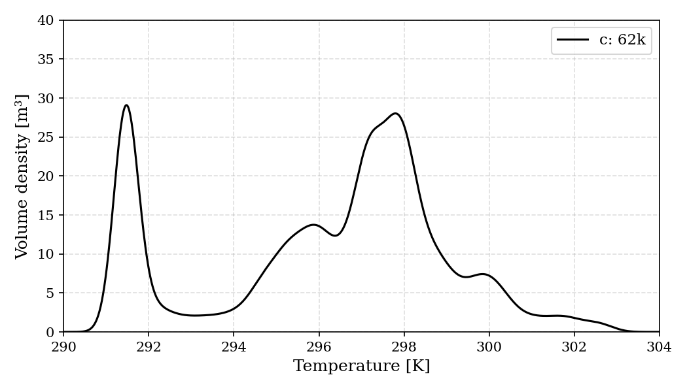

# Simulating Datacenter Temperature Distribution with OpenFOAM

**Paper**: Barestrand et al., "Modelling Convective Heat Transfer of Air in a Data Center using OpenFOAM — Evaluation of the Boussinesq Buoyancy Approximation"
**Published**: OpenFOAM Journal, Vol. 3 (2021), [doi:10.51560/ofj.v3.59](https://doi.org/10.51560/ofj.v3.59)

## The task

Reproduce Fig. 3 from the paper using the manuscript and provided OpenFOAM case files, keep the CFD solve on a cloud cluster, and validate the resulting temperature statistics against the paper's coarse-grid regime.

## Why this case matters

This is the cleanest end-to-end cloud-compute case in the docs. It is the best example of SciAgent reading a paper and a case bundle, running real remote simulation work, pulling the outputs back, and closing the loop with an audit-grade verifier.

## What the audited run did

SciAgent recovered the solver recipe from the paper and case files, identified `buoyantBoussinesqSimpleFoam` as the target environment, launched the meshing and solver workflow on a SkyPilot-backed cluster, and returned the resulting fields for KDE-style temperature analysis.

The benchmark intentionally capped the solve at 1000 SIMPLE iterations, so the success criterion is not perfect residual convergence; it is whether the run reproduces the characteristic temperature distribution and stays within the paper's expected coarse-grid regime.

## Outcome against the benchmark criterion

| Metric | Value |
|--------|-------|
| Cell count | **61,811** |
| Cell count error | **0.19%** |
| Volume-weighted mean temperature | **296.2092 K** |
| Temperature range | **290.9645 K to 302.9278 K** |
| Mean temperature in target range 294-298 K | **YES** |

The SciAgent run lands squarely inside the target `294-298 K` band and reproduces the characteristic bimodal datacenter temperature structure from the paper. The matching `cc-bare` baseline, meaning Claude Code without access to SciAgent's registry or compute subagents, also lands in-range at `295.333 K`, so this is another case where the interesting difference is not pass/fail correctness.

## What the audit trail adds

CFD is the clean audit case in the retrospective report:

- the verifier accepted the run as `verified` at confidence `0.91`
- it recorded 16 supporting facts
- it recorded zero issues, zero fabrication indicators, and zero missing-evidence entries

This case also helps on the efficiency story. In the benchmark report, SciAgent was cheaper than `cc-bare` here, and verifier cost was only `1.7%` of total spend. If you want the clearest example of "paper + inputs -> cluster execution -> results back -> verified conclusion," this is the page to read.
