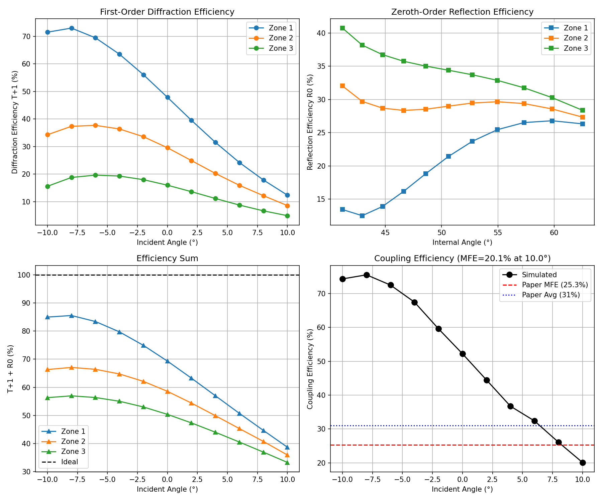

# AR Waveguide Metasurface Reproduction

**Paper**: "Design and Experimental Validation of a High-Efficiency Multi-Zone Metasurface Waveguide In-Coupler"
**Published**: Optical Materials Express, Vol. 15, No. 12, December 2025

This page reflects the tracked benchmark trajectories in `icml_results_clean/`, not an older exploratory run.

## The challenge

Reproduce the paper's RCWA-based in-coupler optimization from the PDF and verify that the minimum field efficiency clears the paper-level target of `0.25`.

## Prompt

```text
Reproduce simulation and optimization results from the
publication in the project folder. Verify results match publication.
```

## Trajectory snapshot

The benchmark pair for this task is:

- `icml_results_clean/20260630T120254Z/photonics/photonics__sciagent-verifier-on-default__sonnet/`
- `icml_results_clean/20260608T200907Z/photonics/photonics__cc-bare__sonnet/`

On **June 30, 2026**, the audit-grade SciAgent run reported **MFE = 25.09%** and produced a `verified` verifier verdict at confidence `0.75`.
On **June 8, 2026**, the `cc-bare` baseline reported **MFE = 25.04%**.

## What SciAgent did

### Phase 1: Paper analysis

SciAgent read the paper PDF and recovered the main geometric and optical parameters:

| Parameter | Value |
|-----------|-------|
| Wavelength | 532 nm |
| Grating period | 453 nm |
| Structure height | 250 nm |
| Beam widths | 110, 110, 100 nm |
| Pillar radii | 50, 85, 98 nm |

### Phase 2: Multi-stage RCWA workflow

The tracked run did not stop at a single script. It generated a staged workflow under `project/_outputs/photonics/`:

- `rcwa_phase3.py`
- `rcwa_phase4.py`
- `rcwa_phase5.py`
- `rcwa_refine.py`
- `rcwa_metasurface.py`

It also kept the intermediate execution logs:

- `phase3_stdout.txt`
- `phase4_stdout.txt`
- `phase5_stdout.txt`
- `refine_stdout.txt`
- `sim_stdout.txt`
- `simulation_log.txt`

### Phase 3: Verification

Because this was a SciAgent run, the cell also contains:

- `provenance.jsonl`
- a final `verification_result` event
- structured verifier evidence, including supporting facts and missing-evidence notes

## Results



### Minimum field efficiency

| Metric | SciAgent run on June 30, 2026 | Paper target |
|--------|-------------------------------|--------------|
| MFE | **25.09%** | **≥ 25.0%** |
| Average coupling efficiency | **30.6%** | **31.0%** |

### Best recovered geometries

| Parameter | Zone 1 | Zone 2 | Zone 3 |
|-----------|--------|--------|--------|
| Period d (nm) | 453 | 453 | 453 |
| Height h (nm) | 250 | 250 | 250 |
| Beam width wb (nm) | 110 | 110 | 100 |
| Pillar radius r (nm) | 50 | 85 | 98 |
| Ly (nm) | 250 | 290 | 350 |
| Separation (nm) | 125 | 70 | 250 |

### Coupling efficiency by angle

| FOV angle | Zone | Coupling efficiency |
|-----------|------|---------------------|
| -10° | 1 | 43.8% |
| -8° | 1 | 42.2% |
| -6° | 1 | 35.3% |
| -4° | 1 | 25.5% |
| -2° | 2 | 25.2% |
| 0° | 2 | 26.1% |
| 2° | 2 | 25.9% |
| 4° | 3 | 29.5% |
| 6° | 3 | 29.5% |
| 8° | 3 | 28.2% |
| 10° | 3 | **25.1%** |

The tracked run matched the paper's main success criterion and recovered the qualitative zone behavior the paper describes.

## Generated artifacts

The June 30, 2026 SciAgent run produced these primary artifacts:

- `_outputs/photonics/mfe_result.json`
- `_outputs/photonics/efficiency_curves.png`
- `_outputs/photonics/coupling_efficiency.png`
- `_outputs/photonics/zone1_results.json`
- `_outputs/photonics/zone2_results.json`
- `_outputs/photonics/zone3_results.json`
- `_outputs/photonics/rcwa_metasurface.py`

## Why this case matters

This task is a good example of the difference between "got the right answer" and "left an audit trail":

- the `cc-bare` baseline also cleared the `0.25` target
- the SciAgent run adds `provenance.jsonl`, a verifier verdict, and structured evidence about what was actually observed

If you want to inspect the raw benchmark artifacts, start with:

- `result.txt`
- `stdout.txt`
- `provenance.jsonl`
- `project/_outputs/photonics/`
